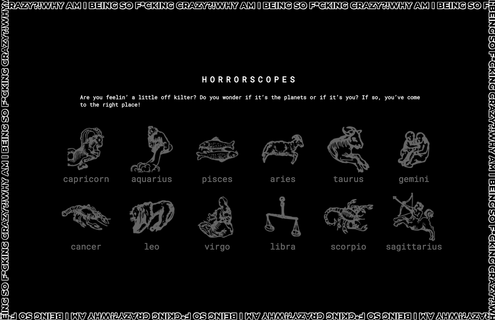
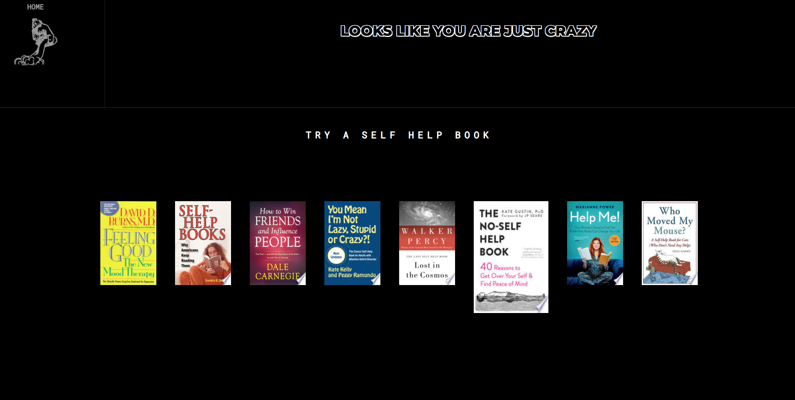
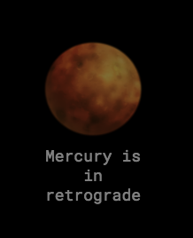

## HORRORSCOPES



The app can be found here: https://horrorscopes-front.herokuapp.com/

(Please forgive any slow lag times as it is hosted on a free heroku account)

## Motivation 

Do you ever feel crazy and wonder if there's something else to blame? Is Mercury in retrograde? Is there a full moon? Let me check my horoscope today... the motivation here was for a quick reference guide to anything that could explain away your or the universe's odd behavior. 

## About this project

This is a horoscope app, aptly named Horrorscopes. It's a quick-reference guide for astrological signs to find an excuse for what could be wrong with them, whether it be an ominous daily horoscope, planets in retrograde or a full moon. 


## Features
Some unique features of the website include a easter egg for when there aren't any planets in retrograde and the moon isn't full. It sends you to a self help page, called from google books API. If clicked, you will be taken to a new site.



## Code Example

```js
 whatMoonPhase = () => {
    let today = new Date(),
    month = today.getMonth() + 1,
    day = today.getDate(),
    year = today.getFullYear();
    function Simple(year,month,day) {
      var lp = 2551443;
      var now = new Date(year, month-1, day, 20, 35, 0);
      var new_moon = new Date(1970, 0, 7, 20, 35, 0);
      console.log('*new-moon*', new_moon)
      var phase = ((now.getTime() - new_moon.getTime())/1000) % lp;
      return Math.floor(phase /(24*3600)) + 1;
    }
    return Simple(year,month,day)
  }

```

## Installation

Clone repo, change directories into repo. 

`$npm install && npm start` 

This should get the correct dependencies installed and runs the app in the development mode.<br>
Open [http://localhost:3000](http://localhost:3000) to view it in the browser.

The page will reload if you make edits.<br>
You will also see any lint errors in the console.

## API Reference
The APIs used in Horrorscopes are

[Google Books API]("https://www.googleapis.com/books/")


[Daily horoscope API](http://ohmanda.com/api/horoscope)


## How to use?
Find and click on your sign

If there are any planets in retrograde, there will be an indicator stating it. You will be able to click it and a modal will pop up sharing how this planet directly affects your sign. Click X at the top to exit. 



Your daily horoscope is found in the bottom right.

Moon phase can be found on your bottom left. For the sake of simplicity, moon phases have been calculated into 4 phases vs. the 8 phases it normally goes through. 

To exit and view other horoscopes, click your sign on the upper left to go back to the home page.

Thank you for using my Horrorscope app!

## Contribute

If you'd like to contribute: 

**Bug fixes I'm working on:** 

* The modal appearance. Some modals will show up with the planets still highlighted in the modal and some will be fine and the modal background shows all black

**Features I'd like to work on:**

* Having access to previous daily horoscopes
* Have planets in retrograde glowing to entice readers to click
* Creating a interval fetch versus a backend fetch for daily horoscopes
* and more.
